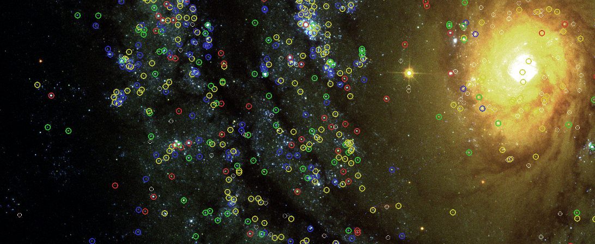

# StarcNet: Machine Learning for Star Cluster Classification

Pytorch code for classification of star clusters from galaxy images by the Hubble Space Telescope (HST). The target galaxies used in this project are provided by the [Legacy ExtraGalactic UV Survey (LEGUS)](https://archive.stsci.edu/prepds/legus/). 



## Getting started

### Prerequisites

**Installing Anaconda:** We recommend using the free [Anaconda Python distribution](https://www.anaconda.com/download/), which provides an easy way for you to handle package dependencies. Please be sure to download the Python 3 version.

**Anaconda Virtual environment:** To set up a virtual environment, run:
```
conda create -n <NAME> python=3.*
```

To activate and enter the environment, run:
```
source activate <NAME>
```

To install requirements, run:
```
conda install --yes --file requirements.txt 
```

To install pytorch follow the instructions [here](https://pytorch.org/).

-------------------------

## Run StarcNet

StarcNet will classify objects from a galaxy or list of galaxies in `targets.txt`.

* Links to the mosaic(s) files should be in `frc_fits_links.txt`.
* Links to the cluster catalog(s) (with objects coordinates) should be in `tab_links.txt`.
* If galaxy mosaics are not in the LEGUS catalogs (or any other online survey in `.FITS` and `.tab`), they should be saved manually into `legus/frc_fits_files/` and `legus/tab_files/` folders respectively.

To run demo, if galaxy mosaics and cluster catalogs need to be downloaded:

```
bash demo.sh 1
```
If galaxy mosaics and cluster catalogs are already on disk:
```
bash demo.sh
```

The original code comes ready to download catalog and classify star clusters from galaxy NGC1566. StarcNet predictions are saved into `output/` folder:

* Comma-separated values (`.csv`) file with galaxy, id, coordinates and predictions: `predictions.csv`
* Text file with ids, coordinates, and predictions: `output.tab`
* Text file with ids, coordinates, predictions, and scores: `output_scores.tab`

-------------------------

### Acknowledgements

This work is supported by the [National Science Foundation (NSF)](https://nsf.gov/index.jsp) of the United States under the award [\#1815267](https://nsf.gov/awardsearch/showAward?AWD_ID=1815267).
